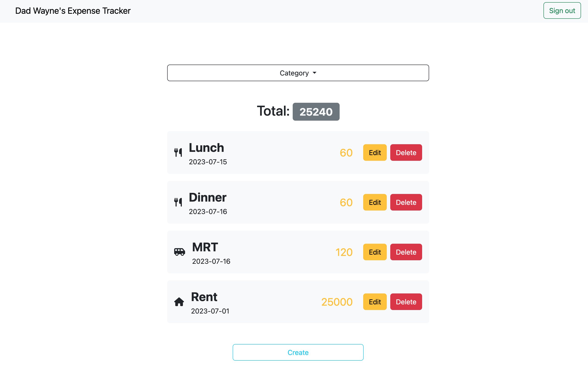
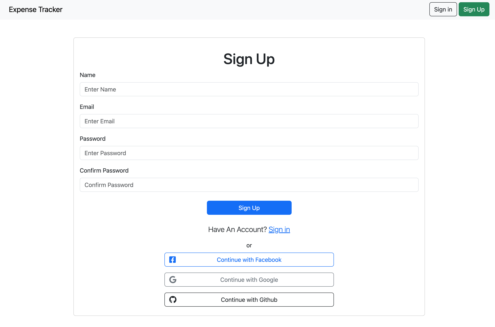
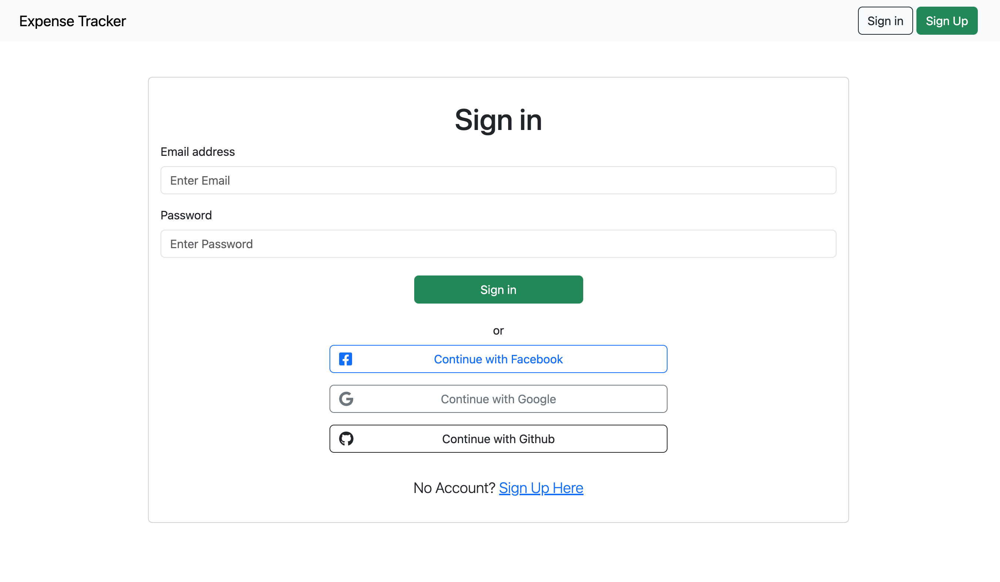

# Expense Tracker Website



This Expense Tracker website is designed to help you keep track of your expense activity and achieve your financial goal. It built using Node.js, Express, and MongoDB, providing features including account creation, sign-in and sign-out functionalities, third-party login authentication with Facebook, Google, and GitHub, as well as CRUD (Create, Read, Update, Delete) operations for personal expenses.

## Features


- Register
  - User registration through email and password.
  - Warning message for missing required fields during registration.
  - Password mismatch warning during registration. 
  - Warning message for signing up the same email.
  - Register message available upon successful register an account. 


- Sign-in features 
  - Prompts for sign-in before accessing the main pages. 
  - Warning messages for attempting to sign in without input.
  - Sign in using an email that does not exist
  - Sign in with wrong password
  - Third-party sign-in support.

- Sign out
  - Sign-out message available upon successful sign out.

- CRUD functionality
  - Browse all listed expenses.
  - Create new expense listings
  - Edit an expense.
  - Delete an expense.
  - Filter feature for expense listings based on category.

## Environment Setup

To run the project, make sure you have Node.js installed on your system. Then, follow these steps:

1. Make sure you have Node.js and npm installed on your system.
2. Clone the repository:
```
git clone https://github.com/scheng0718/expense-tracker.git
```
3. Navigate to the project directory: 
```
cd expense-tracker
```
4. Install the necessary packages: 
```
npm install
```
5. Obtain the cluster information from MongoDB. 
6. Construct the .env file (use .env.example as a template). The required variables include:
```
FACEBOOK_ID=SKIP
FACEBOOK_SECRET=SKIP
FACEBOOK_CALLBACK=http://localhost:3000/auth/facebook/callback
GITHUB_ID=SKIP
GITHUB_SECRET=SKIP
GITHUB_CALLBACK=http://localhost:3000/auth/github/callback
GOOGLE_ID=SKIP
GOOGLE_SECRET=SKIP
GOOGLE_CALLBACK=http://localhost:3000/auth/google/callback
MONGODB_URI=mongodb+srv://<Your Account Name >:<Your Password>@<Your Cluster>/expense-tracker?retryWrites=true&w=majority
SESSION_SECRET=ThisIsMySecret
PORT=3000
```

- Get FACEBOOK_ID and FACEBOOK_SECRET at https://developers.facebook.com
  - Click ``My Apps`` 
  - Click ``Create App``
  - Click ``Allow people to log in with their Facebook account``
  - Fill out your ``new app name`` and ``email`` 
  - Click ``Create app`` 
  - Select the ``app`` you just created 
  - Click ``Settings``
  - Click ``Basic``
  - ``App ID`` and ``App secret`` can be used in your .env file. 
  - Click ``Products`` , then ``Configure`` and ``Setting`` 
  - Add your ``Valid OAuth Redirect URIs``
  - Click ``Use cases``, then in Authentication and account creation click ``Edit``
  - Grant the permission for email. Click ``Add``, Will see ``Ready for testing``

- Get GITHUB_ID and GITHUB_SECRET at https://github.com/settings/developers
  - Click ``New OAuth App``
  - Fill out ``Application name`` and ``Homepage URL``
  - Use ``http://localhost:3000/auth/github/callback`` as your ``Authorization callback URL``
  - Click ``Register application``
  - Click the app you just created. ``Client ID`` will be used in GITHUB_ID. ``Client secrets`` will be your GITHUB_SECRET.

- Get GOOGLE_ID and GOOGLE_SECRET at https://console.cloud.google.com/apis/credentials
  - Click ``OAuth consent screen`` 
  - User Type is ``External`` 
  - Click ``CREATE`` 
  - Click ``+ CREATE CREDENTIALS`` ,then ``OAuth client ID`` 
  - Provide your ``Name`` for OAuth and click ``Save``
  - Use ``http://localhost:3000/auth/google/callback`` as your ``Authorized redirect URIs``
  - ``Client ID`` and ``Client secret`` can be used. 
 
7. Import the default user and restaurant seed data into your MongoDB database.
```
npm run seed
```
8. The email and password for testing purpose.
    ||Name|Email|Password|
    |:--|:--|:--|:--|
    |1|Dad Wayne|user1@example.com|1234abcd|
    |2|Shin Wayne|user2@example.com|1234abcd|
9. Seeder data 
    ||Name|Date|Amount|
    |:--|:--|:--|:--|
    |1|Lunch|2023.7.15|60|
    |2|Dinner|2023.7.16|60|
    |3|MRT|2023.7.16|120|
    |4|Movie: Captain Marvel|2023.7.18|220|
    |5|Rent|2023.7.01|25000|

10. Start the server: 
```
npm run start
```
11. Open your web browser and visit: 
```
http://localhost:3000
```
12. To exit the application and stop the server: 
```
ctrl + c
```

## Environment SetUp

- bcryptjs: 2.4.3
- connect-flash: 0.1.1
- dotenv: 16.3.1
- express: 4.18.2
- express-handlebars: 7.0.7
- express-session: 1.17.3
- method-override: 3.0.0
- mongoose: 7.3.4
- passport: 0.6.0
- passport-facebook: 3.0.0
- passport-github2: 0.1.12
- passport-google-oauth20: 2.0.0
- passport-local: 1.0.0


## Developer

This project was developed by Evan Cheng.

